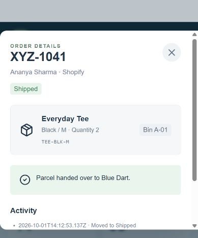

# Fulfillment Hub

A working order-fulfillment demo for XYZ Commerce, built with React, TypeScript, Vinext, and Cloudflare D1. Includes 18 sample orders, six products, and two warehouse locations. All customer and order data is synthetic.



## Run in VS Code

### Requirements

- Node.js 22.13 or newer, with npm.
- VS Code (optional).
- Internet access for the first dependency installation. A Cloudflare account is not required to run locally.

### 1. Download and open

On GitHub, choose **Code > Download ZIP**, then extract it. Open the extracted folder in VS Code using **File > Open Folder**. Make sure `package.json` is directly inside the folder you open.

Open **Terminal > New Terminal**. Run the following commands one at a time.

### 2. Install dependencies and build

```sh
npm ci
npm run build
```

### 3. Set up the local database (first run only)

Run BOTH commands below, in this order:

```sh
node --import ./scripts/sites-env.mjs ./node_modules/wrangler/bin/wrangler.js d1 execute DB --local --config dist/server/wrangler.json --persist-to .wrangler/state --file drizzle/0000_large_richard_fisk.sql
node --import ./scripts/sites-env.mjs ./node_modules/wrangler/bin/wrangler.js d1 execute DB --local --config dist/server/wrangler.json --persist-to .wrangler/state --file drizzle/0001_glorious_manta.sql
```

Apply each migration only once to a new local database. The first creates the workspace table; the second creates the login tables. Sample orders are created automatically after sign-in.

### 4. Start the app

```sh
npm run dev -- --port 5174
```

Open **http://127.0.0.1:5174/login**. If the terminal prints another port because 5174 is occupied, open that printed URL instead. Keep the terminal running while using the app. Press **Ctrl+C** to stop it.

For later runs, you only need the start command; do not repeat the database setup. Data survives browser refreshes and server restarts.

### 5. Sign in

Click **Office team** or **Warehouse team**, then **Sign in**. You can also enter:

| Account | Email | Password |
| --- | --- | --- |
| Office | office@xyz.demo | OfficeDemo!2026 |
| Warehouse | warehouse@xyz.demo | WarehouseDemo!2026 |

These are intentionally public demo credentials. Both accounts have the same permissions and share the workspace; the warehouse account initially opens its work queue.

## Windows troubleshooting

- **npm is not recognized:** install Node.js, then close and reopen VS Code. Check `node --version` and `npm.cmd --version`.
- **PowerShell blocks npm.ps1:** use `npm.cmd` in place of `npm` in the commands above. For example, `npm.cmd ci` and `npm.cmd run dev -- --port 5174`.
- **Missing login/workspace tables:** complete both database commands in step 3.
- **Table already exists:** that migration has already been applied; do not run it again. Apply any migration you have not yet run.
- **No website link appears:** check the terminal for an error. A local development URL uses `http://`, not `https://`.

## Features and workflow

- Overview, Orders, Warehouse, Inventory, Dispatch, and Issues views.
- Priority-first queue, overdue indicators, order search, and status filters.
- Order lifecycle: Received > Picking > Packing > Ready for pickup > Shipped.
- Courier selection with illustrative rates and pickup times.
- SKU and quantity validation; main-warehouse stock is deducted after successful picking.
- Packing verification and mandatory staging rack.
- Physical collection confirmation before shipment.
- Open issues block order progress until a resolution is recorded.
- Validated transfers from overflow to the main warehouse.
- Persistent server storage with version checks to prevent concurrent overwrites.

## Checks

```sh
node scripts/test-workflow.mjs
npx tsc --noEmit
npm run build
```

The workflow test covers lifecycle transitions, wrong SKU rejection, stock deduction, packing and collection checks, issue blocking/resolution, and stock transfers.

## Project structure

- `app/dashboard.tsx`: interactive fulfillment workspace.
- `app/login/page.tsx`: demo login interface.
- `app/api/hub/route.ts`: server-side validation and workspace persistence.
- `app/api/auth/`: login, session, and logout endpoints.
- `lib/fulfillment.ts`: sample data and workflow rules.
- `lib/auth.ts`: demo accounts and session helpers.
- `db/` and `drizzle/`: database schema and migrations.
- `scripts/`: local setup, build helpers, and workflow checks.

## Scope and limitations

This is an evaluation demo, not a production warehouse system. Each order has one product line. Stock is not reserved before picking. Courier rates are sample values; there are no live store/courier integrations, purchased shipping labels, payments, or barcode hardware integrations.

The workspace is stored as one versioned JSON record. Both demo accounts share permissions. Sessions expire after eight hours; cookies are HttpOnly and SameSite=Strict, with Secure enabled on HTTPS. Local login works on loopback hosts; hosted demo login requires the `PUBLIC_DEMO=true` runtime setting. Real production use needs managed identities, role-based permissions, normalized stock/order tables, and an immutable audit trail.

The source includes the existing build/runtime configuration so local behavior matches the implemented project. Local database files, sessions, dependencies, generated builds, videos, and audio recordings are excluded from this repository.
